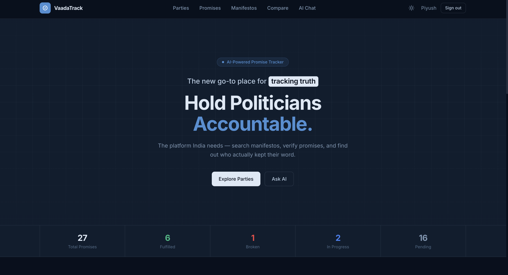

# 🏛️ VaadaTrack - Political Manifesto Tracker & AI Assistant


> An intelligent, full-stack application built to track, analyze, and compare political party manifestos using Retrieval-Augmented Generation (RAG) and Large Language Models (LLMs).

## ✨ Features

- **🤖 AI-Powered "Ask Manifesto" Chat:** Ask complex questions about a specific party's promises and get accurate, context-aware answers powered by Groq and LLaMA 3.
- **📊 Cross-Party Comparison:** Select multiple political parties and instantly compare their manifestos side-by-side on key issues like Healthcare, Economy, and Education.
- **🛡️ Secure Admin Dashboard:** Protected routes allowing administrators to upload new manifesto PDFs, extract text, generate semantic embeddings, and sync them to the database.
- **⚡ Blazing Fast RAG Pipeline:** Custom TF-IDF chunking and cosine similarity search algorithm built natively in Node.js for lightning-fast manifesto retrieval.
- **📱 Responsive & Polished UI:** Beautiful, modern glass-morphic interface built with Tailwind CSS and React Markdown.

## 📸 Screenshots

*(Please replace these placeholder paths with actual screenshots of your application!)*

| Home Dashboard | AI Chat Interface |
|:---:|:---:|
|  |  |
| **Manifesto Comparison** | **Admin PDF Upload** |
|  |  |

## 🛠️ Technology Stack

**Frontend:**
- React.js
- Tailwind CSS (with `@tailwindcss/typography` for markdown)
- Axios & React Router

**Backend:**
- Node.js & Express.js
- MongoDB & Mongoose (Database & Embeddings storage)
- PDF-Parse (Document extraction)
- Groq SDK (LLM inference)
- JSON Web Tokens (JWT Auth)

**Deployment:**
- Docker & Docker Compose (Containerization)
- Nginx (Reverse Proxy)
- Vercel (Frontend Hosting)
- Render.com (Backend API Hosting)

## 🚀 Quick Start (Local Development)

### 1. Clone the repository
```bash
git clone https://github.com/yourusername/VaadaTrack.git
cd VaadaTrack
```

### 2. Set up Environment Variables
Create a `.env` file in the `backend/` directory:
```env
PORT=8000
MONGO_URI=your_mongodb_connection_string
JWT_SECRET=your_super_secret_jwt_key
GROQ_API_KEY=your_groq_api_key
FRONTEND_URL=http://localhost:3000
```

### 3. Run with Docker (Recommended)
You can spin up the entire stack using Docker Compose:
```bash
docker-compose up --build
```
The app will be available at `http://localhost`.

### 4. Run Manually without Docker
**Start the Backend:**
```bash
cd backend
npm install
npm run dev
```

**Start the Frontend:**
```bash
cd frontend
npm install
npm start
```
The app will be available at `http://localhost:3000`.

## 🧠 How the AI (RAG) Works
1. **Ingestion:** Admins upload a PDF manifesto. The backend parses the PDF into raw text.
2. **Chunking & Embeddings:** The text is split into semantic chunks. We calculate a TF-IDF vocabulary and generate vectors for each chunk, saving them to MongoDB.
3. **Retrieval:** When a user asks a question, the backend calculates the cosine similarity between the user's query and the manifesto chunks, pulling the top 5 most relevant sections.
4. **Generation:** The relevant context is injected into a prompt and sent to Groq's LLaMA 3 model to generate a highly accurate, hallucination-free response.

## 📄 License
This project is licensed under the MIT License.
